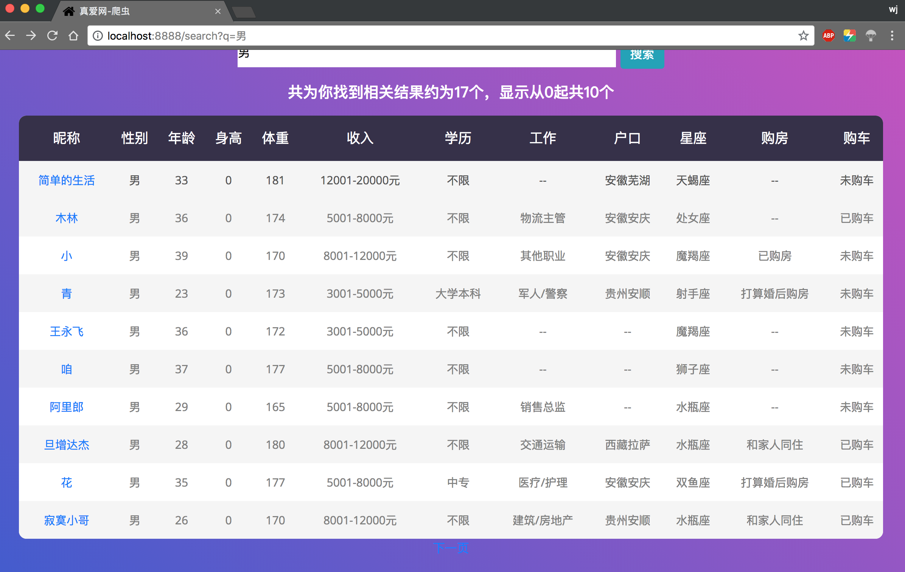

## 珍爱网爬虫-golang版
### 简介
这个是《Google资深工程师深度讲解golang》中爬虫项目的源码，官方没有提供，小编自学期间逐步完善的，前端页面小编重找了个，但不影响整体结果。
目前该项目源码，小编更新到了：带有前端展示以及ElasticSearch存储并发版  

### 环境
docker
docker中开个elasticsearch镜像
### 依赖包
1. gopm  
为了便于从google服务器拉取某些go包
```text
go get -u github.com/gpmgo/gopm
``` 
2. golang.org/x/net/html 
用于自动发现当前html页面是哪种编码
```text
gopm get -g -v 
```
3. golang.org/x/text
用于对文本内容进行转码
```text
gopm get -g -v golang.org/x/text
```  
4. ElasticSearch客户端
不解释，这东西搞IT的都应该懂
小编的ElasticSearch服务器端用的5.x版本，因此安装的elastic.v5，具体请到该地址对号入座：https://github.com/olivere/elastic
```text
go get -v gopkg.in/olivere/elastic.v5
```
